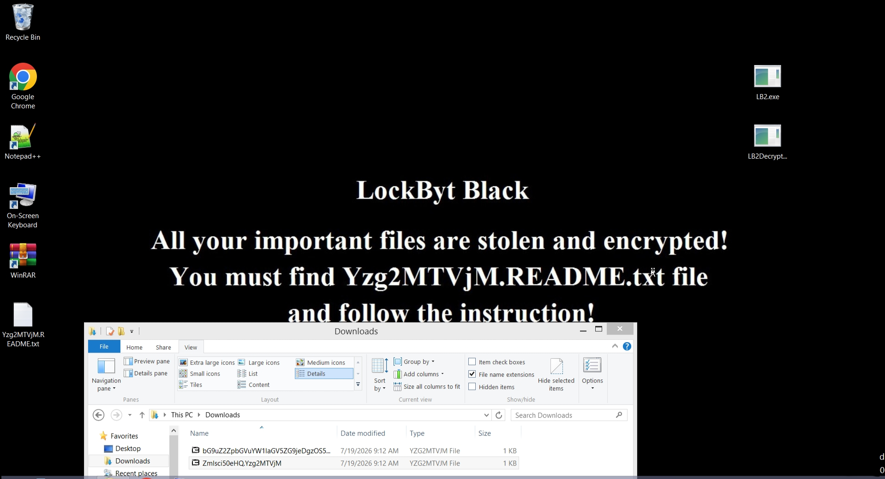

# LockBytBlack
LockByt Ransomware Builder

## Warning

Do **NOT** Expect this to be Fast as LockBit, Due to Limitations of .NET 4 (C#) this is the best i could do,LockBit is written in a Native Language (C) it is **DEFINITELY** faster Than LockByt

## Features
- **Algorithm Switching**
- **XChaCha/XSalsa with Configurable Rounds** (8/12/20)
- **RSA with Configurable Bits** (1024/2048/3072/4096)
- **Backup Wipe**
- **Parallel Tuner**
- **Multi Threaded Encryption**
- **Fast Encryption**
- **PEM & XML RSA Keys**
- **Change Icon of Encrypted Files** (LockBit 3.0 Black icon)
- **UAC Bypass** (fodhelper,cmstp,computerdefaults)
- **Clear Logs**
- **Defender Killer** (only for Windows Defender, Requires Administrator privileges)
- **Steal Files** (4GB Limit)
- **Wallpaper** (Dynamic,1:1 of LB3's Wallpaper)
- **Encrypt Network**
- **Encrypt Local Disks**
- **Open Ransom Note**
- **Melt**
- **Mutex**

## Security
- Random IV Per File
- RNG for Key & IV generation's
- XChaCha IV 24-Bytes (192-Bits)

## Summary
Fast And Secure,
I can not determine the exact Encryption speed Due to it depending on the environment
(Victim Hardware,Threads)

## Victim Machine Visual

## Educational Purposes Only

This repository and its contents are intended solely for academic research, educational purposes, and authorized security analysis. 

### Terms of Use

* **Strictly Educational:** The source code, concepts, and methodologies demonstrated in this repository are designed to help developers and security researchers understand binary structure, metadata manipulation, and assembly patching mechanics.
* **No Unauthorized Deployment:** The use of any concepts or artifacts derived from this project against systems without explicit, prior written authorization from the system owner is strictly prohibited.
* **No Liability:** This software is provided "as-is" without any express or implied warranty. Under no circumstances shall the author or contributors be liable for any direct, indirect, incidental, special, exemplary, or consequential damages, or legal repercussions arising from the use or misuse of this repository.
* **User Responsibility:** By downloading, cloning, or interacting with this repository, you assume full responsibility for your actions and compliance with all applicable local, national, and international laws.
